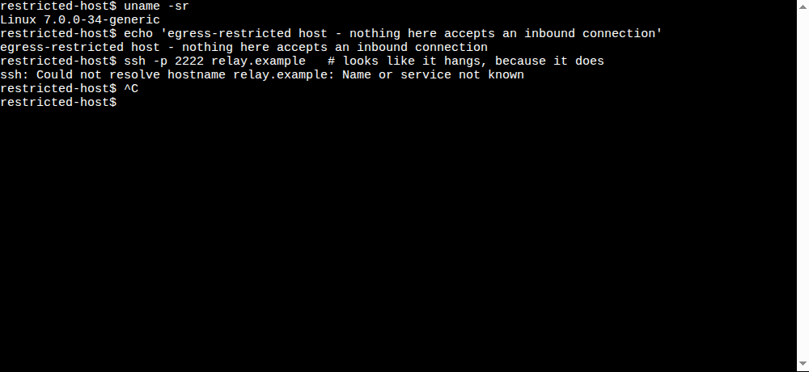

# muse-proxy

Outbound-only hosts, reachable anyway.

Some sandboxes, NAT boxes and locked-down VMs can open outbound WebSocket
connections but cannot accept inbound traffic at all: inbound TCP answers are
filtered, raw sockets are neutered. `muse-proxy`
turns a single outbound WebSocket into a multiplexed tunnel that carries real
TCP streams and interactive shells back into
the host.

## Architecture

```
  your laptop / phone (ssh, scp, browser)
        │  plain TCP / HTTPS
        ▼
  ┌──────────────┐   WSS (always dialed OUT by the client)  ┌──────────────┐
  │    server    │◄────────────────────────────────────────│    client    │
  │ (public host)│   one persistent connection,             │ (egress-only │
  │  :2222 TCP   │   many independent streams               │  host)       │
  │  /shell web  │                                          │  → 127.0.0.1 │
  └──────────────┘                                          └──────────────┘
```

The client always dials out; the server never dials in. Each inbound TCP
connection on the server becomes one stream; the client forwards it to an
allowlisted local target (e.g. `127.0.0.1:22`).

## Components

- `cmd/muse-proxy-client` — runs on the egress-only host. Dials
  `wss://server/fwd/<secret>`, holds the multiplexed connection, forwards
  each stream to the allowlist. Auto-reconnect with backoff, keepalive pings.
- `cmd/muse-proxy-server` — runs on the public host. Validates the secret,
  accepts TCP on a loopback port, bridges each connection to a stream; serves
  the web-shell UI.
- `internal/proto` — the frame protocol both sides share. See `PROTOCOL.md`.
- `web/` — browser terminal for the web-shell path.
- `deploy/` — systemd units, nginx snippets, env examples.
- `docs/` — `SECURITY.md`, `DEPLOYMENT.md`, `CONTRIBUTING.md`.
- [`RESEARCH.md`](RESEARCH.md) — the network behaviour that motivated this.
- [`MAINTAINERS.md`](MAINTAINERS.md) — how to carry the project forward.

## Protocol

Versioned, framed binary messages over one WebSocket. v1 carries TCP
streams; v2 adds the shell/pty frames. Full spec:
[`PROTOCOL.md`](PROTOCOL.md).

## Why this exists

Some hosts cannot accept inbound connections at all. Not "firewall rules you
can edit" — the packets never arrive, and no amount of server-side
configuration changes that. If you have hit a machine where `ping` works, a
port scan looks healthy, and `ssh` hangs with no error, read
[`RESEARCH.md`](RESEARCH.md): the behaviour, the measurements that pin it
down, and why port changes and L3 tunnels do not fix it.

When SSH is not the thing you need, `/shell/` gives you a terminal on the
egress-only host from any browser, over the same connection:



The server bridges `wss://host/shell/ws/<secret>` to a pty the client spawns;
xterm.js is embedded in the server binary, so there is nothing to install in
the browser. The page takes the secret from a password field and never puts it
in a URL. **Put your own authentication in front of it** — anyone who loads the
page and knows the secret gets a shell (see below).

## Quickstart (forwarding path)

```bash
# 1. one secret per deployment, never commit it
openssl rand -hex 32

# 2. public host
muse-proxy-server -secret <secret> -tcp 127.0.0.1:2222 -http 127.0.0.1:18080

# 3. egress-only host (behind nginx: wss://example.com/fwd/<secret>)
muse-proxy-client -url wss://example.com/fwd/<secret> -allow 127.0.0.1:22

# 4. from anywhere that can reach the server
ssh -p 2222 user@127.0.0.1        # on the server itself
ssh -J user@server -p 2222 user@127.0.0.1   # via jump host
```

## Install

**Prebuilt binaries** — pick the archive for your platform from the
[releases page](https://github.com/tidyinfo/muse-proxy/releases) and verify it:

```bash
sha256sum -c checksums.txt
```

The client is Linux-only; the server also builds for macOS and Windows. See the
platform table below.

**From source** — no build step, no toolchain surprises:

```bash
go install github.com/tidyinfo/muse-proxy/cmd/muse-proxy-server@latest
go install github.com/tidyinfo/muse-proxy/cmd/muse-proxy-client@latest
```

**Container** — the server only. The fastest route if you already run a VPS:

```bash
cp deploy/server.env.example server.env   # edit: paste a generated secret
chmod 600 server.env
docker compose up -d
```

`docker-compose.yml` binds both published ports to loopback and expects an
nginx (or Caddy) in front for TLS — see `deploy/nginx/muse-proxy.conf`.
Without a reverse proxy:

```bash
docker run --rm -p 127.0.0.1:2222:2222 -p 127.0.0.1:18080:18080 \
  -v /etc/muse-proxy:/etc/muse-proxy:ro \
  ghcr.io/tidyinfo/muse-proxy:latest \
  -secret-file /etc/muse-proxy/secret \
  -http 0.0.0.0:18080 -tcp 0.0.0.0:2222 -target 127.0.0.1:22
```

Note the `-http 0.0.0.0` override: the defaults bind to loopback, which is
correct on a host but unreachable from outside a container.

Every release is built by GitHub Actions from the tagged commit, keyless-signed
with cosign and carries an SLSA provenance attestation, so you can check where a
binary came from rather than taking the release page's word for it. The exact
`cosign verify-blob` invocation is in the release notes.

## Security model (summary)

- The secret is a bearer token and the *only* thing authenticating either
  end. It may travel in the URL path (default) or as `Authorization: Bearer`
  (`-secret-file` on the client); the server accepts either. Treat it like a
  password, never commit it, rotate on suspicion. Full comparison in
  [`docs/SECURITY.md`](docs/SECURITY.md).
- The client allowlists forwarding targets — it can never be steered into
  becoming an open proxy.
- The server should listen on loopback only; expose further access via your
  own jump host / firewall rules.
- **`/shell/` needs a second authentication layer.** The `<secret>` on that
  page authenticates the *client tunnel*, not the human in front of the
  browser. Reverse-proxy it behind basic auth, mTLS or SSO before exposing
  it, or anyone who reaches the page and knows the secret gets a shell.
  Details and threat model: `docs/SECURITY.md`.

## Platform support

| | linux/amd64 | linux/arm64 | linux/arm (v7) | darwin/* | windows/* |
|---|---|---|---|---|---|
| `muse-proxy-server` | yes | yes | yes | yes | yes |
| `muse-proxy-client` | yes | yes | yes | **no** | **no** |

The **client is Linux-only**: it allocates a pty via `/dev/ptmx` and
`TIOCGPTN`/`TIOCSPTLCK`, which are Linux-specific ioctls. On macOS and
Windows, run the client on a Linux host (a container or VM is fine) and point
`-allow` at the service you actually want to reach. The server is pure
net/http and cross-compiles anywhere.

## Roadmap

- v1: TCP forwarding (implemented, tested)
- v2: web shell — pty sessions over the same multiplexed connection
  (implemented, tested; page at `/shell/`)
- next: pty allocation via `posix_openpt` so the client builds on macOS
- later: per-stream ACLs, audit logging
- planned: Homebrew tap, Nix flake

## License

MIT — see [LICENSE](LICENSE).
